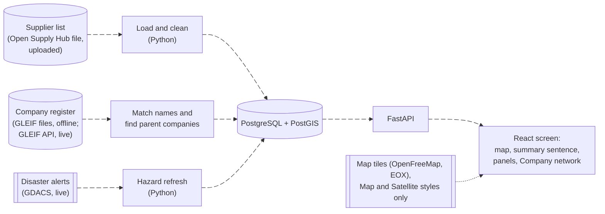
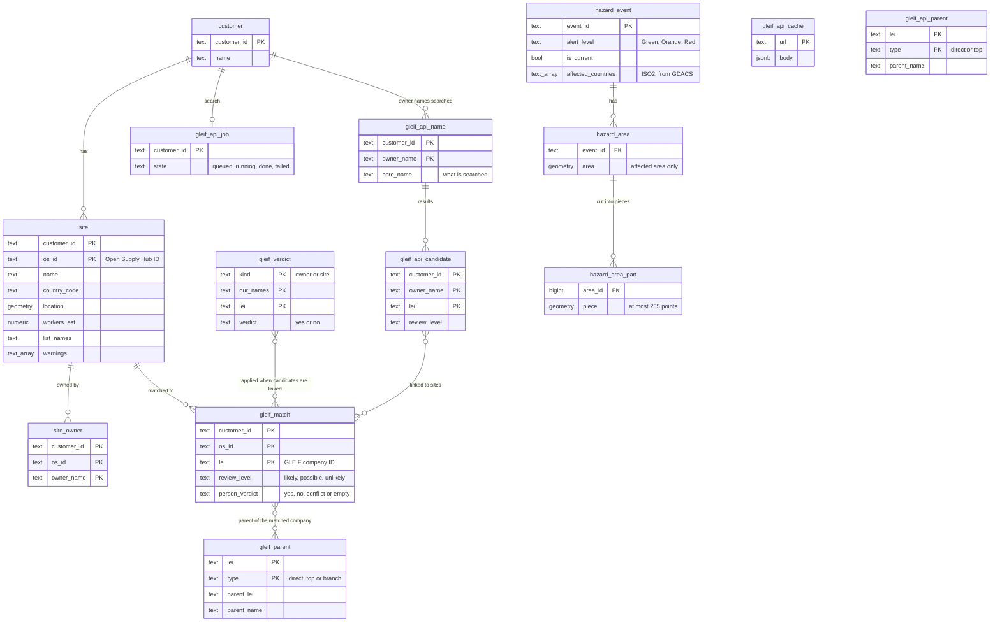
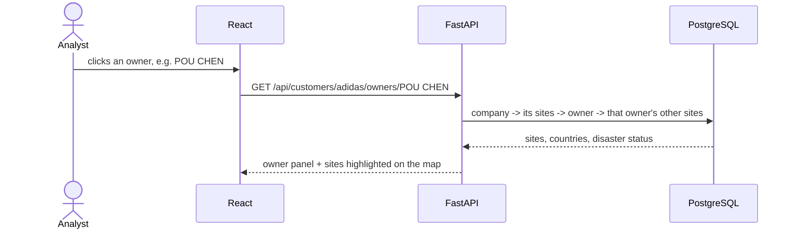
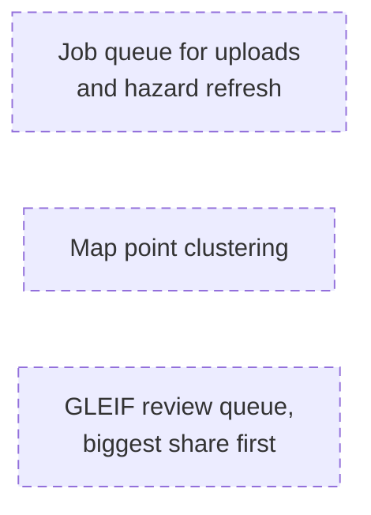

# Architecture: Geographic Supplier Risk Intelligence (MVP)

## 1. What it does

A company uploads its Open Supply Hub supplier list and sees, on a map, where its suppliers are concentrated, which owner companies hold many of its sites, and which sites sit inside a current disaster area. The users are the company's own procurement and risk team, and the CPO. The demo uses the public lists of adidas, Nike, Apple, Samsung and Amazon.

## 2. How data flows

- **Load and clean** keeps the needed columns, drops the personal `claim_*` columns, cleans owner names without merging spellings, and works out estimated workers and warnings. One upload changes one company only.
- **Match names:** owner and site names are matched to GLEIF (the GLEIF file for adidas and Nike, GLEIF's API for every other company). A match is used only after a person confirms it on the Company network page; parents come from GLEIF's relationship records.
- **Hazard refresh** reads GDACS's current events once per event type, on every start and on request, and keeps only each event's *affected* areas.

## 3. Storage model

14 tables: 8 for the graph, `hazard_area_part` for speed, and 5 for the GLEIF API search.

- A site is inside a disaster when its point lies in a current event's affected area **and** its country is in the event's `affected_countries` (an empty list: the area alone). This is worked out when asked, not stored, using `hazard_area_part`: on 2 Oct 2026 Amazon's view went from 6.2 s to 0.3 s with the pieces.
- Each company's rows are keyed by `customer_id`, so a site on two companies' lists is stored twice.
- `gleif_verdict` holds verdicts given on the page, one per (kind, our names, LEI), shared by every company with that name and LEI. `gleif_match` is rebuilt on every start and after each verdict: yes and no on one site link is stored as `conflict`, which is not confirmed.
- Every table is created only if it is missing, so a start never resets data.

## 4. What happens when a user asks a question

Example: *"I clicked an owner. Where are its other sites?"*, a multi-hop question.

| The user asks | The app follows |
|---|---|
| "Where is my supply concentrated?" | company → sites → share per country → High / Watch, and a one-sentence summary |
| "What about this site?" | site → owners, warnings, disaster status, and its parent company if a person has confirmed the GLEIF match |
| "Which sites does this disaster hit?" | event → its sites → their owners → those owners' other sites |

## 5. Key rules

- **Open site:** on the company's current list, and not closed.
- **Share basis:** estimated workers when known for at least 90% of the company's sites; otherwise site counts.
- **High:** 10% or more in one country or under one owner, or a site inside a current Orange or Red disaster area. **Watch:** 5% or more, or a site inside a current Green area.
- **Owner names:** cleaned (upper case, punctuation and words like LTD removed); different spellings are not merged.
- **Disasters:** only GDACS's *affected* areas count. Forecast areas, uncertainty cones, distance circles and the flood "Global area" do not.
- **Every number shows its base**, for example "owner known for 66 of 749 sites".

## 6. How this maps to the substrate

Brief, Section 5: "A live, queryable entity relationship graph across Product, Supplier, Customer, Location and Contact, so teams can answer which suppliers provide which products to which customers at which locations."

| Entity | In the MVP | Evidence |
|---|---|---|
| Supplier | Built | Sites and their owner companies (Open Supply Hub), with GLEIF parents once confirmed |
| Customer | Partly | The company whose list is loaded (`customer`); not which supplier serves which of its own customers |
| Location | Built, country only | Natural Earth's 1:50m states file covers 9 countries, not Vietnam; the 1:10m file is 40.7 MB as GeoJSON |
| Product | Not used | Product words merge every contributor's words (80 of adidas's 766 open sites have "NIKE"); sites with product words range from 4.3% (Samsung) to 78.4% (Nike) |
| Contact | Not built | Personal data, and rare: 3 of Amazon's 1,732 open sites have a point of contact; the `claim_*` columns are dropped on load |

## 7. At 50× the size: drawn, not built

- **Open Supply Hub's free download cap is 5,000 locations a year.** At 50× today's 2,327 seeded site rows (116,350), that is about 23 years of downloads.
- **GLEIF review grows** from 440 file candidates to about 22,000.
