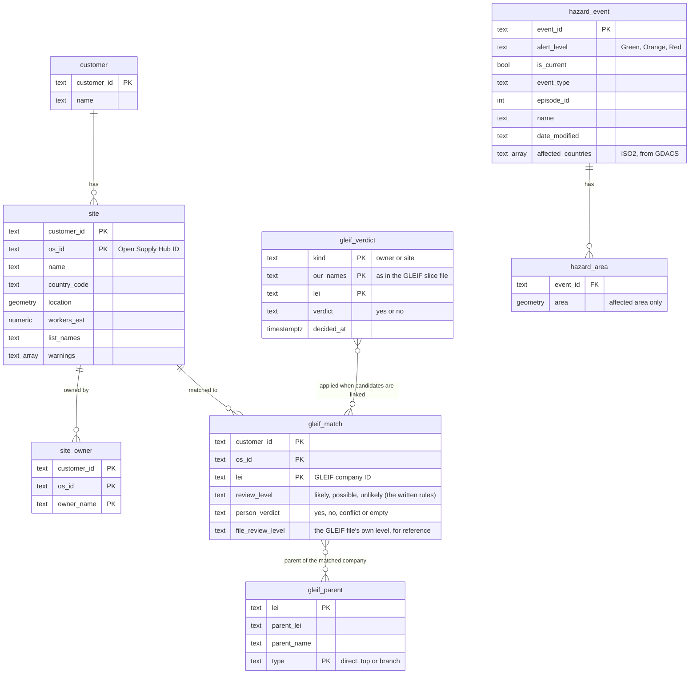
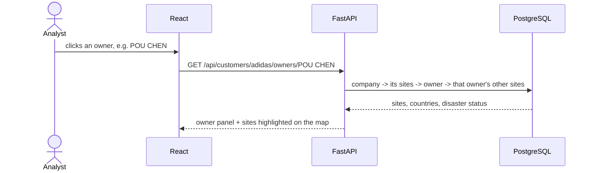
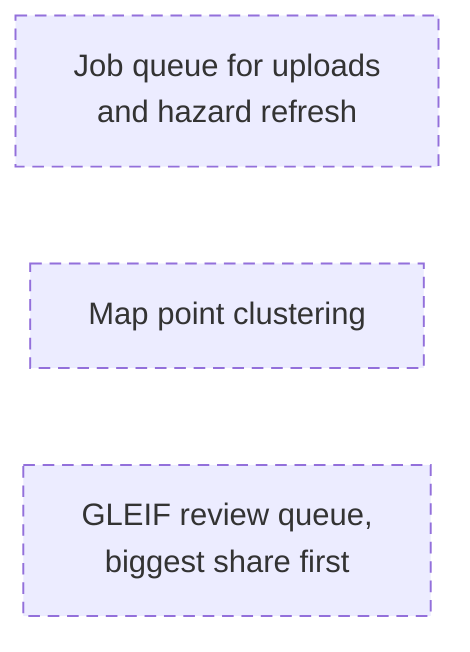

# Architecture: Geographic Supplier Risk Intelligence (MVP)

**What it does:** a company uploads its supplier list and sees, on a map, where its suppliers are concentrated, which owner companies hold many of its sites, and which sites sit inside a current disaster area.

**Who uses it:** the company's own team. Per the brief, that is "Procurement Managers, Supply Chain Risk Analysts and Strategic Sourcing Managers", plus the CPO, who "wants a single answer about where the company is exposed".

**Demo data:** the public supplier lists of adidas, Nike, Apple and Samsung, from Open Supply Hub. We do not claim they are FourKites customers.

---

## 1. The problem statement, and what the MVP does

| Part of the problem statement | In the MVP |
|---|---|
| Supplier risk concentration on an interactive map | ✅ Each country's share of the company's sites (or estimated workers), marked High or Watch |
| Single-source dependency | ✅ As **owner dependency**: owner companies that hold a large share of the sites. The data has no materials, so it cannot be done by material |
| Risk overlays on a global network map | ✅ Current disaster areas (GDACS), site warnings, and links site → owner → parent company |
| Alternative supplier identification | ❌ Not built: the data does not say what each site makes |

---

## 2. How it works

- **Load and clean:** keeps only the columns needed, and drops the personal contact columns (`claim_*`). It cleans owner names, and never merges different spellings. It works out estimated workers and warnings.
- **Match names (GLEIF):** our owner and site names are matched to GLEIF's company register. **A match is shown only after a person confirms it**, on the Company network page. Parent companies come from GLEIF's relationship file.
- **Hazard refresh:** reads the current events from GDACS, and keeps only each event's *affected* areas.
- **One upload changes one company only.** Other companies' data is never touched.
- **Stack:** Python + FastAPI and React + TypeScript (the brief's house stack), with PostgreSQL + PostGIS for the map checks (point inside a disaster area).

---

## 3. Storage model

A site is inside a disaster area when its point lies in a current event's `hazard_area` **and** its country is in that event's `affected_countries` (an empty list: the area alone). The database works this out when asked; it isn't stored. A site inside the area in a country the event does not list is not counted, and the panels show it as "inside the area, but GDACS does not list <country> as affected".

**Changed in the build:**
- `gleif_match` has `customer_id`, because a site's key is `customer_id` + `os_id`.
- `gleif_parent` is keyed on (`lei`, `type`), because a company can have both a direct and a top parent. `type` also allows `branch` (IS_INTERNATIONAL_BRANCH_OF).
- `gleif_verdict` (an 8th table) holds the verdicts given on the Company network page. It is keyed like a candidate of the GLEIF slice file (`kind`, `our_names`, `lei`), so one verdict covers every company and site the candidate links to. No row means no verdict. Verdicts are also saved in committed files, so an empty database starts with them: the GLEIF file's verdict column (adidas, Nike) and `data/reference/gleif_api_verdicts.csv` (company, our name, LEI; used when that company's GLEIF API search finds the candidate); a verdict given on the page is used over them. 13 verdicts are saved (all yes, given on 2 Oct 2026): adidas 4 and Nike 1 in the GLEIF file's verdict column, Apple 2 and Amazon 9 in `data/reference/gleif_api_verdicts.csv` (ACE TURTLE OMNI and ALPINE APPARELS are shared by adidas and Amazon, HENKEL AG AND KGAA by Apple and Amazon).
  - It is created on backend start only if it does not exist, like every table. A start never resets data: existing companies, including uploaded ones, are kept, and no `docker compose down -v` is needed.
  - On every start, and at once after each verdict, the candidates are linked again (`gleif_match` is rebuilt): a saved verdict is used over the file's `person_verdict` column. For a site linked to one LEI by two candidates, a verdict from one and none from the other decides the link; yes from one and no from the other is stored as `conflict`: not confirmed, no parent shown, and marked "conflicting verdicts – needs review" on the page.
- Five tables hold the GLEIF API search for companies other than adidas and Nike (`backend/app/gleif_api.py`): `gleif_api_cache` (every answer, so nothing is fetched twice), `gleif_api_job` and `gleif_api_name` (one search per owner name, with progress), `gleif_api_candidate` (at most 10 rated results per name; linked to the owner's sites into `gleif_match` like the file's candidates) and `gleif_api_parent` (fetched only after a confirm). Like every table they are created only if missing, so no reset is needed.
- `site` has `warnings`, for the site warnings.
- `hazard_event` has five more columns:
  - `event_type` and `episode_id`: the GDACS area request needs them.
  - `name`: shown on screen.
  - `date_modified`: the refresh compares it to find changed events. GDACS's event list has no `datetime` field; `datemodified` is the change marker.
  - `affected_countries`: the ISO2 codes in the event list's `affectedcountries`, updated on every refresh. It was added after the first build, so a start adds it to an existing database (`ADD COLUMN IF NOT EXISTS`; no reset).
- Spatial indexes on `site.location` and `hazard_area.area`.
- Each affected area is also kept as small pieces (`hazard_area_part`, PostGIS `ST_Subdivide`, at most 255 points), and its map shape is worked out once (`hazard_area.draw`); triggers keep both in step with `hazard_area`, and existing areas are filled in on start. A point is in an area exactly when it is in one of its pieces, so the answers are the same, but the inside check no longer unpacks a large area for every site: on 2 Oct 2026 Amazon's view went from 6.2 s to 0.3 s and its drought panel (DR1018332, 22,021 points) from 9.9 s to 0.2 s.
- A site's disaster level comes from its **event's** alert level: Orange or Red means High, Green means Watch. It does not come from the colour of a cyclone's wind-speed band.
- Map areas are simplified, and their rings are turned clockwise, for drawing only. The inside check uses the stored shapes.
- The GDACS event list is read **once per event type**: the same call, with one type in `eventlist`. Its pages are sorted only by end date, and many events share one, so a read of all six types at once repeats some events and skips others. On 30 Sep 2026 that read missed 12 current events: 11 wildfires, and the drought DR1015915 that holds Nike's site BR2019085Q71GZV. Read per type, only the wildfire list (13 pages) still repeats rows. The refresh counts the repeats, and the screen says how many events may be missing.
- GLEIF files are read again, and GDACS is refreshed once in the background, on every backend start. If the last refresh failed, stored areas stay in the database but are not shown or counted; the screen says "Disaster data unavailable".

---

## 4. What happens when a user asks a question

Example: *"I clicked an owner. Where are its other sites?"* This is a multi-hop question.

Other questions follow the same path:

| The user asks | The app follows |
|---|---|
| "Where is my supply concentrated?" (opening the app) | company → sites → share per country → High / Watch, plus a one-sentence summary |
| "What about this site?" | site → owner(s), warnings, disaster status, and its parent company if a person has confirmed the GLEIF match |
| "Which sites does this disaster hit?" | event → its sites → their owners → those owners' other sites |

---

## 5. Key rules

- **Open site:** on the company's current list, and not closed.
- **Share basis:** estimated workers, when they are known for at least 90% of the company's sites; otherwise site counts. The screen shows which one is in use.
- **Risk levels:**
  - **High:** 10% or more in one country or under one owner, OR a site inside a current Orange or Red disaster area.
  - **Watch:** 5% or more, OR a site inside a current Green area.
- **Owner names:** cleaned (upper case, punctuation and words like LTD removed). Different spellings are not merged.
- **Disasters:** only GDACS's *affected* areas count. Forecast areas, uncertainty cones, distance circles and the flood "Global area" are not counted.
- **Every number shows its base**, for example "owner known for 66 of 749 sites".

---

## 6. At 50× the size: drawn, NOT built

- **The Open Supply Hub free download cap is 5,000 a year.** At 50× today's 2,327 site rows (116,350), that's about 23 years of downloads.
- **GLEIF review grows** from 440 candidate matches to about 22,000.

---

## 7. Not built, and why

| Not built | Why |
|---|---|
| Alternative suppliers | The data does not say what each site makes |
| Single-source by material | No material data |
| Supplier-to-supplier links | The data does not say which site supplies which |
| Performance trends | No supplier performance data |
| Per-company login | Demo only |

All of these need the company's **own** supplier data: what each site makes, and which site it supplies.

Full list and reasons: README.md.

---

## 8. Demo numbers (checked 2026-09-30)

| | adidas | Nike | Apple | Samsung |
|---|---|---|---|---|
| Open sites | 766 | 625 | 749 | 187 |
| Share basis | workers | workers | sites | sites |
| Largest country | VN 31.5% | VN 40.6% | CN 45.9% | KR 31.0% |
| Countries at High | 3 | 3 | 2 | 4 |
| Largest owner (on the share basis) | POU CHEN 7.4% (Watch) | FENG TAY 9.3% (Watch) | INTEL, 9 sites (1.2%) | HITACHI, 9 sites (4.8%) |
| Sites inside a current disaster area | 5 (Green) | 3 (Green) | 0 | 0 |

The last row is live GDACS data as of 30 Sep 2026, and changes with every refresh. The other rows, and the GLEIF numbers below, are checked by the tests (`backend/tests/`).

**GLEIF:** 30 likely name matches (from the adidas and Nike names). Of those, 3 have a parent company in GLEIF: Coats Group PLC, Avery Dennison Corporation and SAYE S.P.A. They are shown once a person confirms the match.
