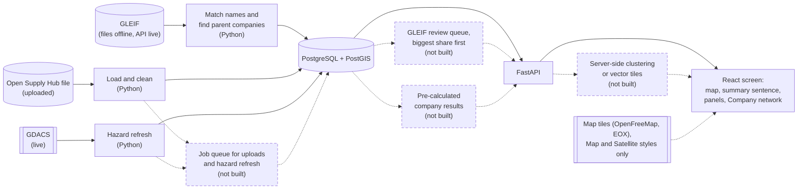
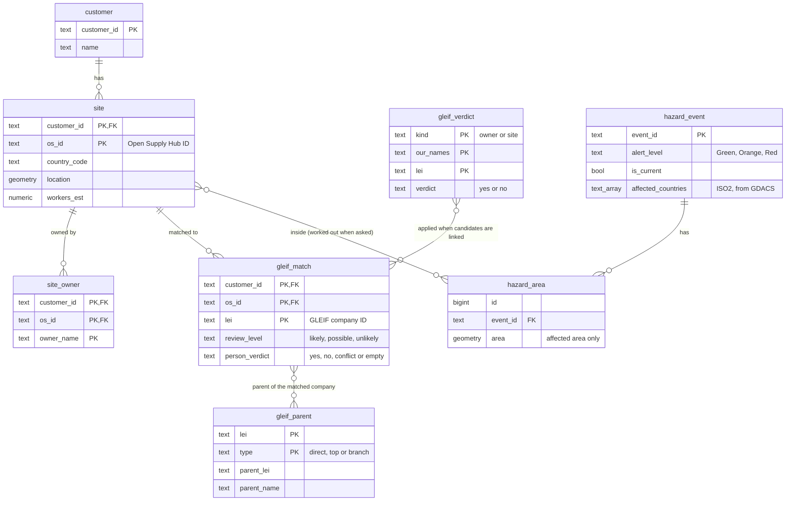
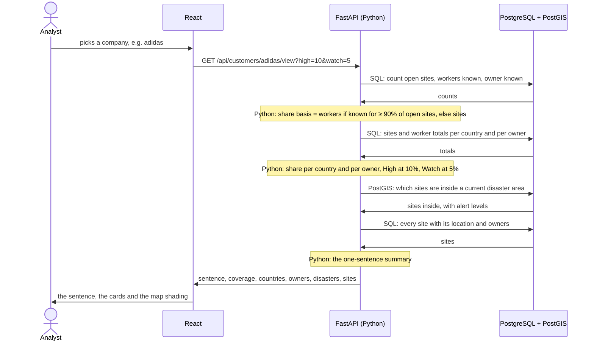
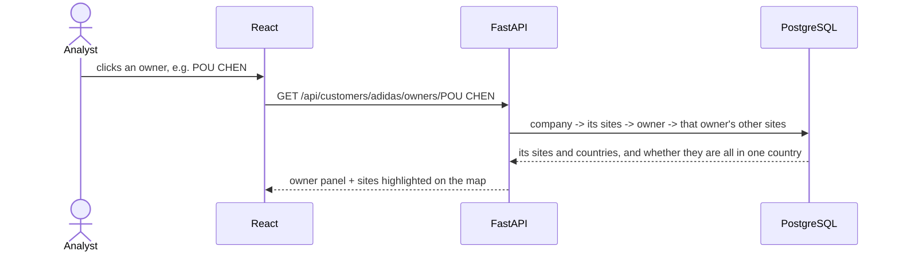

# Architecture: Geographic Supplier Risk Intelligence (MVP)

## 1. Overview: what is it?

A company uploads its Open Supply Hub supplier list and sees, on a map, where its suppliers are concentrated, which owner companies hold many of its sites, and which sites sit inside a current disaster area. It is for the company's own procurement and risk team and the CPO; what it does is in the [README](../../README.md) and the [product guide](../walkthrough/index.html), and how each decision is implemented is in [docs/RULES.md](../RULES.md).

## 2. Data flow: where does data come from and go?

Dashed boxes are components that would exist at 50× the size but are not built (section 5).

- **Load and clean** keeps the needed columns, drops the personal `claim_*` columns, cleans owner names without merging spellings, and works out estimated workers and warnings. One upload changes one company only.
- **Match names:** owner and site names are matched to GLEIF (the GLEIF file for adidas and Nike, GLEIF's API for every other company). A match is used only after a person confirms it on the Company network page; parents come from GLEIF's relationship records.
- **Hazard refresh** reads GDACS's current events once per event type, on every start and on request, and keeps only each event's *affected* areas.

## 3. Storage model: how is the graph modelled?

The 8 graph tables, with their keys and main fields:

Also: hazard_area_part (speed), and gleif_api_cache, gleif_api_job, gleif_api_name, gleif_api_candidate, gleif_api_parent (the GLEIF API search) – 14 tables in all.

- A hop is a join, and each company's rows are keyed by `customer_id`, so a site on two companies' lists is stored twice.
- Every table is created only if it is missing, so a start never resets data.

## 4. Query path: a multi-hop question

Example: *"Where is my supply concentrated?"* (the main question)

Example: *"I clicked an owner. Where are its other sites?"*

| The user asks | The app follows |
|---|---|
| "Where is my supply concentrated?" | company → sites → share per country → High / Watch, and a one-sentence summary |
| "What about this site?" | site → owners, warnings, disaster status, and its parent company if a person has confirmed the GLEIF match |
| "Which sites does this disaster hit?" | event → its sites → their owners → those owners' other sites |

## 5. At 50× the size: what breaks first, and how we would know

At FourKites, customers would upload their own supplier data, so this is about the system, not about where the demo data came from. At 50× (116,350 site rows instead of 2,327), in the order things break (the dashed boxes in section 2):

1. **Work done on every page load.** Today each company view recalculates every measure and sends every site and current disaster area. Fix: calculate once when the data changes, store the results (*pre-calculated company results*), and send the map as *server-side clusters or vector tiles*; clustering is browser-only today.
2. **Work done inside a request.** An upload, and a refresh someone asks for, run while the user waits. Fix: a *job queue* with progress, as the GLEIF API search already runs in the background.
3. **Outside services.** GLEIF, GDACS and the map tiles have limits and outages, and become the bottleneck as calls grow. Fix: bulk files instead of many small calls (GLEIF publishes its full data as files, already used for adidas and Nike), caching, retries and background fetching.
4. **Work that needs a person.** Confirming matches grows with the data: GLEIF review from 440 file candidates to about 22,000. Fix: a *review queue* ordered by share of supply.
5. **The database.** Indexes, and partitioning per customer; measure first.

**How we would know before a customer does:** a load test with 50× synthetic data before release (time and size per endpoint); monitoring of response time, response size, job-queue length and age, error rates and outside-service failures, with alerts; and data-quality checks, as each GDACS refresh already records its state, error type and repeated rows.

## 6. How this maps to the substrate: which entities did you build?

Brief, Section 5: "A live, queryable entity relationship graph across Product, Supplier, Customer, Location and Contact, so teams can answer which suppliers provide which products to which customers at which locations."

| Entity | In the MVP | Evidence |
|---|---|---|
| Supplier | Built | Sites and their owner companies (Open Supply Hub), with GLEIF parents once confirmed |
| Customer | Partly | The company whose list is loaded (`customer`), not which supplier serves which of its own customers |
| Location | Built, country only | Natural Earth's 1:50m states file covers 9 countries, not Vietnam |
| Product | Not used | Product words merge every contributor's words: 80 of adidas's 766 open sites have "NIKE" |
| Contact | Not built | Personal data, and rare: 3 of Amazon's 1,732 open sites have a point of contact; `claim_*` columns are dropped on load |
