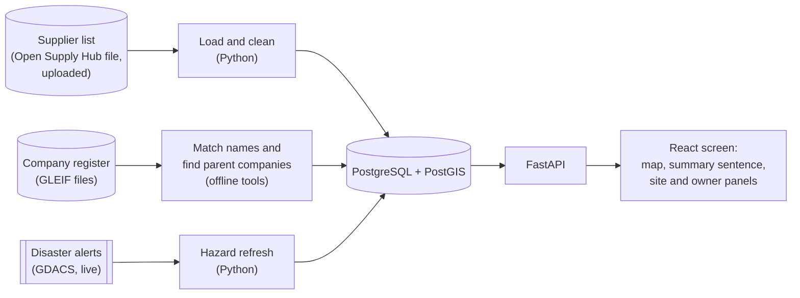
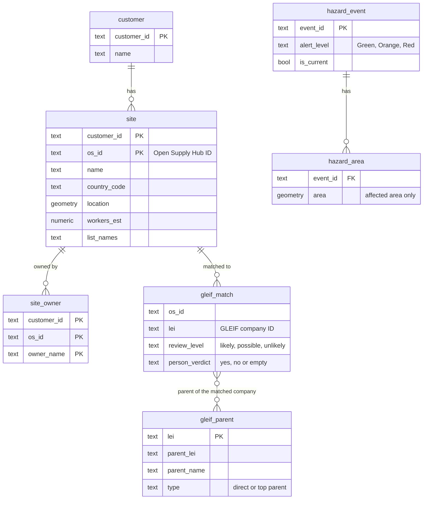
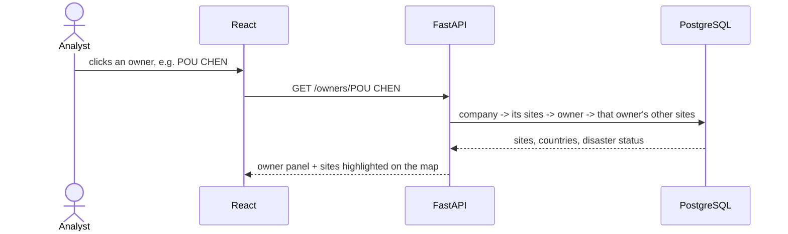
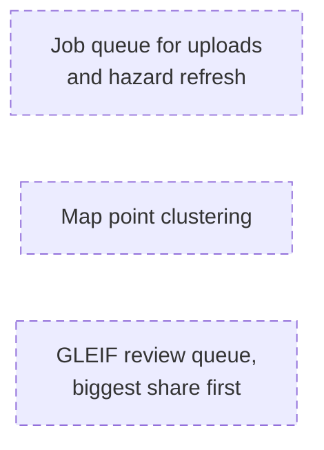

# Architecture: Geographic Supplier Risk Intelligence (MVP)

**[▶ Play the step-by-step diagram](architecture_walkthrough.html)**. Open it in a browser from the local repo; GitHub's website shows HTML files as code.

**What it does:** a company uploads its supplier list and sees, on a map, where its suppliers are concentrated, which owner companies hold many of its sites, and which sites sit inside a current disaster area.

**Who uses it:** the company's own team. Per the brief, that is "Procurement Managers, Supply Chain Risk Analysts and Strategic Sourcing Managers", plus the CPO, who "wants a single answer about where the company is exposed".

**Demo data:** the public supplier lists of adidas, Nike, Apple and Samsung, from Open Supply Hub. We do not claim they are FourKites customers.

---

## 1. The problem statement, and what the MVP does

| Part of the problem statement | In the MVP |
|---|---|
| Supplier risk concentration on an interactive map | ✅ Each country's share of the company's sites (or estimated workers), marked High or Watch |
| Single-source dependency | ✅ As **owner dependency**: owner companies that hold a large share of the sites. The data has no materials, so it cannot be done by material |
| Risk overlays on a global network map | ✅ Current disaster areas (GDACS), site warnings, and links site → owner → parent company |
| Alternative supplier identification | ❌ Not built: the data does not say what each site makes |

---

## 2. How it works

- **Load and clean:** keeps only the columns needed, and drops the personal contact columns (`claim_*`). It cleans owner names, and never merges different spellings. It works out estimated workers and warnings.
- **Match names (GLEIF):** our owner and site names are matched to GLEIF's company register. **A match is shown only after a person confirms it.** Parent companies come from GLEIF's relationship file.
- **Hazard refresh:** reads the current events from GDACS, and keeps only each event's *affected* areas.
- **One upload changes one company only.** Other companies' data is never touched.
- **Stack:** Python + FastAPI and React + TypeScript (the brief's house stack), with PostgreSQL + PostGIS for the map checks (point inside a disaster area).

---

## 3. Storage model

A site is inside a disaster area when its point lies in a current event's `hazard_area`. The database works this out when asked; it isn't stored.

---

## 4. What happens when a user asks a question

Example: *"I clicked an owner. Where are its other sites?"* This is a multi-hop question.

Other questions follow the same path:

| The user asks | The app follows |
|---|---|
| "Where is my supply concentrated?" (opening the app) | company → sites → share per country → High / Watch, plus a one-sentence summary |
| "What about this site?" | site → owner(s), warnings, disaster status, and its parent company if a person has confirmed the GLEIF match |
| "Which sites does this disaster hit?" | event → its sites → their owners → those owners' other sites |

---

## 5. Key rules

- **Open site:** on the company's current list, and not closed.
- **Share basis:** estimated workers, when they are known for at least 90% of the company's sites; otherwise site counts. The screen shows which one is in use.
- **Risk levels:**
  - **High:** 10% or more in one country or under one owner, OR a site inside a current Orange or Red disaster area.
  - **Watch:** 5% or more, OR a site inside a current Green area.
- **Owner names:** cleaned (upper case, punctuation and words like LTD removed). Different spellings are not merged.
- **Disasters:** only GDACS's *affected* areas count. Forecast areas, uncertainty cones, distance circles and the flood "Global area" are not counted.
- **Every number shows its base**, for example "owner known for 66 of 749 sites".

---

## 6. At 50× the size: drawn, NOT built

- **The Open Supply Hub free download cap is 5,000 a year.** At 50× today's 2,327 site rows (116,350), that's about 23 years of downloads.
- **GLEIF review grows** from 440 candidate matches to about 22,000.

---

## 7. Not built, and why

| Not built | Why |
|---|---|
| Alternative suppliers | The data does not say what each site makes |
| Single-source by material | No material data |
| Supplier-to-supplier links | The data does not say which site supplies which |
| Performance trends | No supplier performance data |
| Per-company login | Demo only |

All of these need the company's **own** supplier data: what each site makes, and which site it supplies.

Full list and reasons: README.md.

---

## 8. Demo numbers (checked 2026-09-30)

| | adidas | Nike | Apple | Samsung |
|---|---|---|---|---|
| Open sites | 766 | 625 | 749 | 187 |
| Share basis | workers | workers | sites | sites |
| Largest country | VN 31.5% | VN 40.6% | CN 45.9% | KR 31.0% |
| Countries at High | 3 | 3 | 2 | 4 |
| Largest owner (on the share basis) | POU CHEN 7.4% (Watch) | FENG TAY 9.3% (Watch) | INTEL, 9 sites (1.2%) | HITACHI, 9 sites (4.8%) |
| Sites inside a current disaster area | 5 (Green) | 3 (Green) | 0 | 0 |

**GLEIF:** 30 likely name matches (from the adidas and Nike names). Of those, 3 have a parent company in GLEIF: Coats Group PLC, Avery Dennison Corporation and SAYE S.P.A. They are shown once a person confirms the match.
