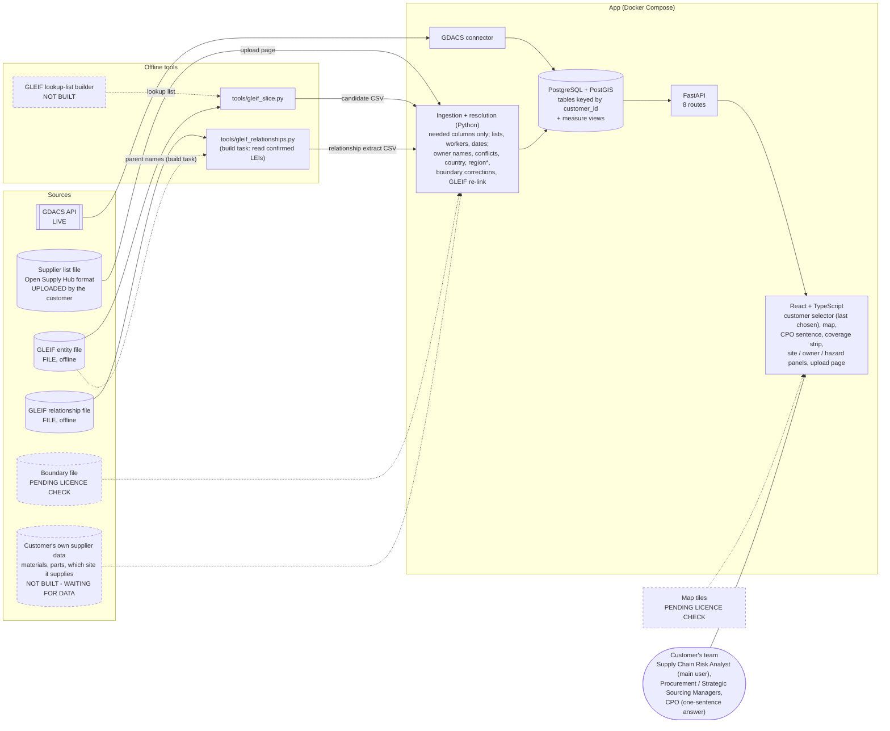
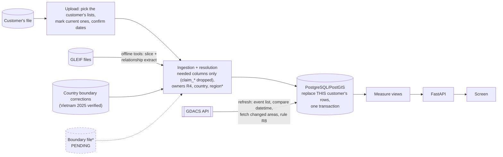
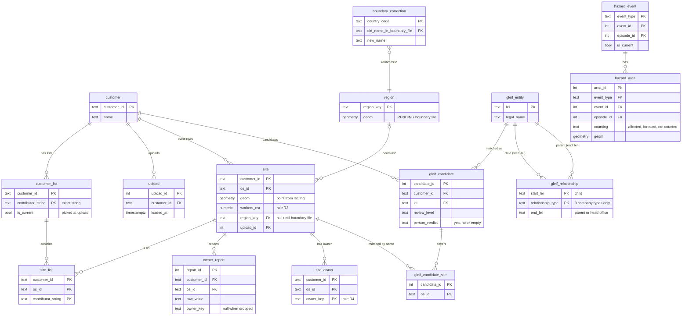
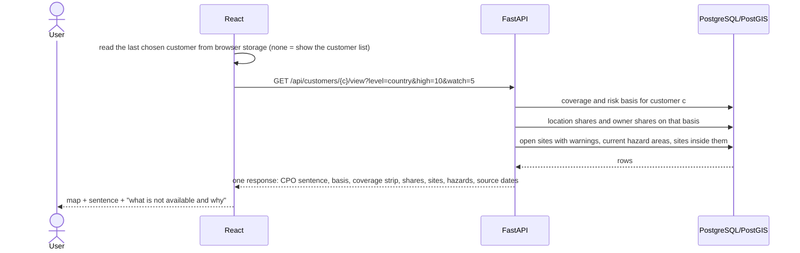
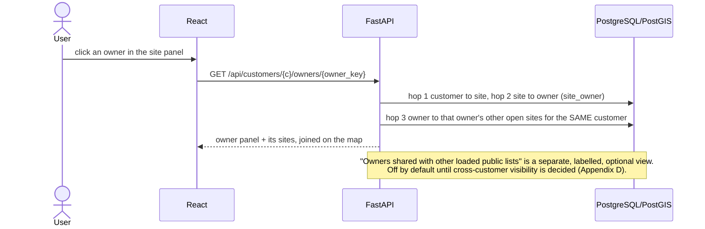
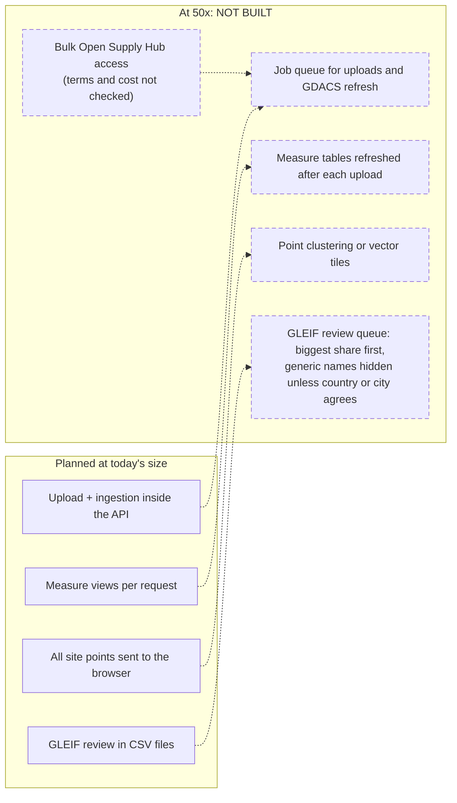
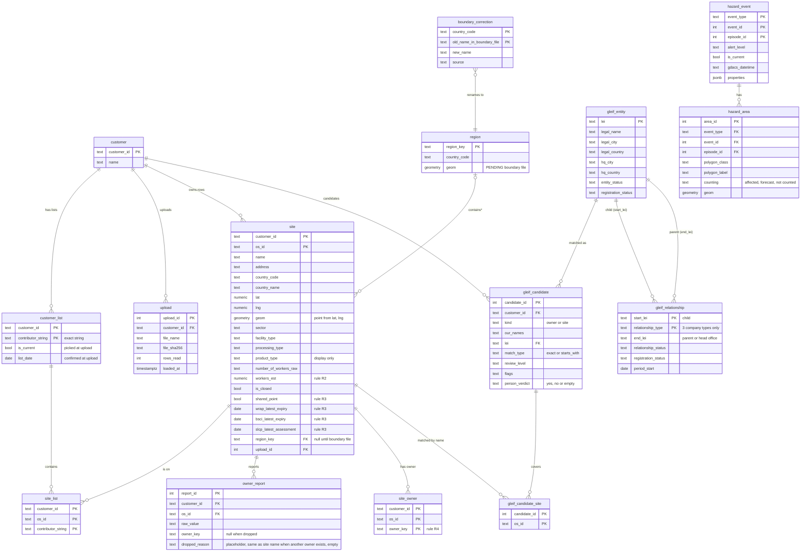

Superseded by docs/architecture/ARCHITECTURE.md. Kept only for the detailed rules and test notes.
# Architecture: Geographic Supplier Risk Intelligence

Status: **design only. Nothing is built.**
Every number comes from `scripts/verify_inputs.py`, or from a one-time check listed in Appendix B.

---

## 1. Summary

1. A FourKites customer uploads its own supplier list (Open Supply Hub format) and sees where its supplier sites and workers are concentrated: by country now, by region once a boundary file is chosen.
2. "Single-source dependency" is shown as **owner dependency**, labelled that way, because there is no material data.
3. Live GDACS hazard areas and data warnings sit on the same map, with the links customer → site → owner → parent company.
4. Each measure switches on only when that customer's data supports it. When it does not, the screen says what is missing.
5. Alternative suppliers and the other "Not built" items wait for the customer's own supplier data.

---

## 2. Words we use

- **Customer:** a FourKites customer. It has one or more supplier lists.
- **Site:** one facility on a list. One site = one `os_id` (the Open Supply Hub ID).
- **Owner:** the parent company named for a site in `parent_company`. **Ownership is not supply.**
- **Open site:** on one of the customer's current lists, and not closed.

---

## 3. Problem statement → what we built

| Part of the problem statement | Status | How |
|---|---|---|
| Supplier risk concentration on an interactive map | Build | Share of a customer's sites (or estimated workers) per country, and per region later; risk levels |
| Single-source dependency | Build as **owner dependency**, labelled that way | Owners with a large share; owners with all sites in one location; owner conflicts. No material data exists |
| Risk overlays on a global network map | Build | GDACS hazard areas; site warnings; links customer → site, owner → site, site → GLEIF parent |
| Alternative supplier identification | **Not built** | No product data per site (section 11) |

- **Who it is for.** FourKites' customers "are large shippers, manufacturers and retailers" (brief). The users are the customer's own team: "Procurement Managers, Supply Chain Risk Analysts and Strategic Sourcing Managers", plus the CPO, who "wants a single answer about where the company is exposed". A customer looks at **its own** suppliers.
- **Demo only: no login.** In real use each customer must see only its own data.
- **Demo customers.** adidas, Nike, Apple and Samsung are used only because their supplier lists are public on Open Supply Hub. We do not claim they are FourKites customers. Their data is in Appendix C.

---

## 4. What works for which customer

A measure switches on for a customer when the field it needs is known for at least one of its open sites. Shares use estimated workers only when workers are known for at least 90% of the customer's open sites; otherwise they use site counts. Every number on screen shows its base ("known for X of Y sites"). The full list of measures is in Appendix A.

| | adidas | Nike | Apple | Samsung |
|---|---|---|---|---|
| Open sites | 766 | 625 | 749 | 187 |
| Risk basis | workers (719 of 766, 93.9%) | workers (625 of 625, 100.0%) | **sites** (workers 65 of 749, 8.7%) | **sites** (workers 4 of 187, 2.1%) |
| Country level | yes | yes | yes | yes |
| Region level | waits for boundary file | waits for boundary file | waits for boundary file | waits for boundary file |
| Owner measures (owner known) | yes (552, 72.1%) | yes (625, 100.0%) | yes (66, 8.8%) | yes (187, 100.0%) |
| Certificate warnings | WRAP, BSCI, SLCP | WRAP, BSCI, SLCP | SLCP only (1 site) | none |
| Facility type | 432 | 494 | not reported | not reported |
| Hazard exposure | yes | yes | yes | yes |
| GLEIF candidates | yes (slice built from adidas and Nike names) | yes | none until the lookup-list tool exists | none until the lookup-list tool exists |

---

## 5. How it works

`*` region needs the boundary file.

- **Stack:** Python + FastAPI, React + TypeScript (the brief's house stack), PostgreSQL + PostGIS. PostGIS is our addition, for point-in-area hazard checks, region shapes and a spatial index. Its cost: it needs Docker.
- **Evidence for PostgreSQL:** the FourKites geo-service schema has `enable_extension "plpgsql"` and `enable_extension "pg_trgm"` (schema lines 17–18), 14 lines mention `jsonb`, and it does not mention PostGIS (script section 18, `--geo-schema`).
- **GDACS** is the only live source. The screen names it "Global Disaster Awareness and Coordination System, GDACS", and says that alerts are automatic, not reviewed by people, and should not be used for decisions without confirmation.
- **GLEIF:** the app makes no live GLEIF calls. Parents come from the relationship file, read offline.
- **Measures are SQL views**, not a separate service. Thresholds and the location level (country or region) are passed in with each request.

---

## 6. Data flow

- **An upload changes one customer only.** In one transaction the app deletes that customer's rows and inserts the new ones. Other customers' rows are never touched. Each upload is logged: file name, file hash, row count, time.
- **Hazard data is shared.** GDACS events and areas are the same for every customer. Only the "which of my sites are inside" view is per customer.
- **Files that are never loaded:** `sites_prepared_for_build_v2.csv`, `gdacs_current_exposure_2026-09-30.csv` and `gleif_parents_checked.csv` are test files only (Appendix B). The two raw GLEIF files are read only by the offline tools.

---

## 7. Storage model

15 tables. Only key columns are shown; every column is in Appendix E.

- **One site row per customer.** The same `os_id` can be on two customers' lists; 7 sites are on both Apple's and Samsung's. It is stored once per customer, so one customer's upload never changes another's data. For those 7 sites the needed columns are identical in both files today.
- **Shared tables:** `region`, `boundary_correction`, `gleif_entity`, `gleif_relationship`, `hazard_event` and `hazard_area` hold public reference data, not customer data.
- **Views, not columns:** open site, owner conflict (2+ owners), coverage per field, risk basis, location share, owner share, and "site inside a current area".

---

## 8. Query path

### 8(a) Opening the app

### 8(b) Clicking an owner (multi-hop, inside one customer)

### 8(c) Clicking a site, and refreshing hazards

| Step | Tables read or written |
|---|---|
| **Site panel:** `GET /api/customers/{c}/sites/{os_id}` | reads `site`, `site_list`, `owner_report`, `site_owner`, and the hazard view (areas the site is inside) |
| **Site panel, parent:** confirmed GLEIF match only (`person_verdict` = yes); then direct parents upward (up to 5 hops) and the top parent | reads `gleif_candidate`, `gleif_candidate_site`, `gleif_entity`, `gleif_relationship` |
| **Refresh 1:** `POST /api/hazards/refresh`; read the event list page by page, until a page has fewer than 100 events | calls the GDACS event list |
| **Refresh 2:** for each current event, compare the stored `datetime` for that event and episode | reads `hazard_event` |
| **Refresh 3:** only for new or changed events, fetch the event areas and apply R8 (affected, forecast or not counted) | calls the GDACS event areas |
| **Refresh 4:** in one transaction, insert or update events and areas, and mark events no longer current; return counts | writes `hazard_event`, `hazard_area` |

The other two multi-hop queries:
- **hazard → site → owner → other sites:** `GET /api/customers/{c}/hazards/{type}/{event_id}/{episode_id}`.
- **site → confirmed GLEIF entity → direct parent → … → top parent** (from the relationship file): the site panel above.

GDACS calls, exactly:
- **Event list:** `GET https://www.gdacs.org/gdacsapi/api/events/geteventlist/SEARCH?eventlist=TC;FL;EQ;VO;DR;WF&fromdate=YYYY-MM-DD&todate=YYYY-MM-DD&alertlevel=green;orange;red&pagesize=100&pagenumber=N`. Always send `alertlevel`: without it, only Orange and Red events come back. Pages hold at most 100 events, newest first.
- **Event areas:** `GET https://www.gdacs.org/gdacsapi/api/polygons/getgeometry?eventtype=XX&eventid=N&episodeid=N`. GDACS publishes no rate limit and asks callers to compare `datetime` before calling again.

### API (only what the screen needs)

| Method | Path | Serves | Reads |
|---|---|---|---|
| GET | `/api/customers` | customer selector | customer, customer_list, upload |
| GET | `/api/customers/{c}/view?level=&high=&watch=` | whole main screen, in one call | measure views, site, hazard tables |
| GET | `/api/customers/{c}/sites/{os_id}` | site panel | site, site_list, owner_report, site_owner, gleif tables, hazard view |
| GET | `/api/customers/{c}/owners/{owner_key}` | owner panel | site_owner, site |
| GET | `/api/customers/{c}/hazards/{type}/{event_id}/{episode_id}` | hazard panel | hazard_area, site, site_owner |
| POST | `/api/hazards/refresh` | refresh button | writes hazard tables |
| POST | `/api/uploads` | upload step 1: file in, list strings with site counts out | writes upload |
| POST | `/api/uploads/{id}/confirm` | upload step 2: customer, picked lists, current lists, dates; runs ingestion and returns the check results | writes this customer's rows |

---

## 9. Key rules in plain words

The full rules are in Appendix A.

- **R1. Lists and open sites.** At upload, the user picks the customer's lists from every list name in the file and marks which are current. An open site is on a current list and not closed.
- **R2. Estimated workers.** A site's estimate is the median of its reported worker numbers; a range counts as its midpoint.
- **R3. Warnings.**
  - For every customer: same coordinates as another site (location may be approximate), owner conflict, and list age.
  - Only where that customer's data has the dates: certificate warnings (WRAP, BSCI, SLCP).
- **R4. Owner names.** Each reported owner name is cleaned: upper case; punctuation and legal-form words removed. Spellings are never merged, and non-Latin letters are kept. A site's own name is dropped as owner only when the site has another owner.
- **R5. Owner conflict.** A site has 2 or more owner names after R4.
- **R6. Location.** Country for every customer. Region once a boundary file is chosen, with country boundary corrections (Vietnam 2025 today).
- **R7. GLEIF.** A name match is a candidate until a person confirms it. Parents come from GLEIF's relationship file (company links only), followed up to 5 hops, with the top parent shown separately.
- **R8. Hazards.** A site is exposed when it lies inside an **affected** area of a current GDACS event. Forecast areas are shown, but do not set a risk level.

  | Type | Counted as affected | Forecast (shown separately) | Not counted |
  |---|---|---|---|
  | TC | Poly_Green/Orange/Red labelled "60/90/120 km/h" | same classes with a date label | Poly_Cones, Point_Polygon_* |
  | FL | Poly_Affected | – | Poly_Global |
  | EQ | Poly_SMPInt_N ("Intensity N") | – | Poly_Circle |
  | WF, DR | Poly_area | – | – |
  | VO | Poly_Cones_0 ("OBS") | Poly_Cones_6/12/18 | Poly_Circle |

- **R9. Risk levels.** Shares use estimated workers when they are known for at least 90% of open sites; otherwise site counts. High: 10% or more, or a site inside a current Orange/Red area. Watch: 5% or more, or a site inside a current Green area.

---

## 10. Scale (50×): drawn, NOT built

| Verified limit | Number |
|---|---|
| Open site rows at 50× | 50 × 2,327 (adidas 766 + Nike 625 + Apple 749 + Samsung 187) = 116,350, about 23 years of Open Supply Hub's free cap of 5,000 a year (23.27). Rows are per customer, as stored; 2,232 distinct open sites today |
| GLEIF review rows | 440 → about 22,000 |
| Generic owner names | "HI TECH" alone has 215 GLEIF candidates (re-counted from the raw GLEIF file) |

Database size and query time at 116,350 site rows were not measured, so no limit is claimed for them.

---

## 11. Not built, and why

| Not built | Why | What would unlock it |
|---|---|---|
| Alternative suppliers | The data does not say what each site makes | The customer's own supplier data (material or part per site) |
| Single-source by material | No material or component data | The same |
| Product grouping | Product words are merged across every contributor; they are shown only as information | The customer's own product per site |
| Supplier-to-supplier links | The data does not say which site supplies which | The customer's own data on which site it supplies |
| Tier labels | adidas's and Nike's lists do not define tiers; the Apple and Samsung list names do not mention them | The customer's own tier definition per list |
| Near-real-time supplier lists | Lists are only as fresh as their publishers make them (Apple 2019, Samsung 2021, Nike February 2024) | A supplier data feed that updates daily |
| Performance trends | No supplier performance data | Performance data per supplier, such as delivery records |

The customer's own supplier data gives supplier, location, material or part, and which site it supplies. It is drawn in section 5 and marked "not built — waiting for data". The reasons in full are in `README.md`, `ASSUMPTIONS.md` and `DECISIONS.md`.

---

## 12. What is needed next

- **Before building:** the Open Supply Hub data licence; the map tiles licence.
- **For full results:**
  - the boundary file, for region level;
  - person review of the 30 likely GLEIF matches, for parents.
- **All other open items:** Appendix D.

---

## Appendix A. Rules in detail

**R1. Lists and open sites.**
- At upload, the app shows every distinct string in `contributor (list)` with its site count, sorted by count and searchable. The demo files have 881 (adidas + Nike file), 36 (Apple) and 13 (Samsung) such strings.
- The user picks the customer's lists and marks which are current. For each list the user confirms its date, pre-filled with a year written in the string when there is one.
- **Open site** = on one of this customer's current lists AND `is_closed` is not True.
- A site on 2 or more of the customer's lists shows every list name.
- No list string is written into the rules; the demo picks are in Appendix C.

**R2. Estimated workers.** Each pipe-separated value of `number_of_workers` is a whole number, or the midpoint (a+b)/2 of a range "a-b". The site's estimate is the median of all its values, with duplicates kept. Empty means unknown.

**R3. Warnings.**
- **Same coordinates as another site (location may be approximate)** (every customer): the same `lat` and `lng` as another row of the same upload file.
- **Owner conflict** (every customer): 2 or more owner names after R4. Conflicts are shown, never resolved.
- **List age** (every customer): the confirmed list date and its age.
- **Certificates** (only when that date column is filled for the customer):
  - WRAP or BSCI expired: the latest expiry date on record is before the as-of date.
  - SLCP older than 2 years: the latest assessment date + 2 years is before the as-of date.
  - The as-of date is an open item.

**R4. Owner names.** Applied to each pipe-separated value of `parent_company`, and to the site name for the last step:
1. upper case (where the script has case);
2. `&` → AND;
3. punctuation → space;
4. collapse spaces (a no-break space counts as a space);
5. remove these legal-form words: CO, COMPANY, CORP, CORPORATION, GMBH, GROUP, HOLDING, HOLDINGS, INC, JSC, LIMITED, LLC, LTD, PLC, PRIVATE, PT, PVT, SA;
6. drop placeholders (`NO GROUP (..)`, `N/A`, `NA`, tested before step 5), and drop an owner name equal to the site's own name ONLY when the site has another owner name; if it is the site's only owner, keep it.

**Why step 6 keeps a sole self-named owner:** some lists name a site after the company that owns it. Always dropping the self-name deleted real owner groups: Apple's INTEL (9 sites) and MICRON TECHNOLOGY (6), and Samsung's HITACHI (9). See DECISIONS #13.

Different spellings are never merged. Letters of every script are kept: Chinese, Japanese, Korean and accented Latin letters stay. Legal-form words are removed only as separate words, so in scripts written without spaces (for example `…股份有限公司`) they stay part of the name.

**R5. Owner conflict** = 2 or more owner names remain after R4.

**R6. Location.**
- **Country** from `country_code`, for every customer (filled for every open site of the four demo customers).
- **Region** from the boundary file, once chosen.
- **Country boundary corrections** rename regions when a country changes its map. There is one verified correction today: Vietnam 2025 (Resolution 202/2025/QH15, Article 1). It maps 39 old provinces to 23 new ones: 33 merged, 6 unchanged, none split. The region key is `VN:<new province>`. Whether other countries need corrections is an open item.

**R7. GLEIF.**
- **Candidates.** Links are candidates, with match type (exact / starts_with), review level, flags and evidence. Only a person-confirmed link is shown as confirmed; today 0 are confirmed.
- **One verdict, in one file.** The person verdict is kept only in the slice file's `person_verdict` column, read into `gleif_candidate.person_verdict`. `gleif_parents_checked.csv` is a test file only; its `person_confirmed_same_company (yes/no)` column (empty: 0 of 30) is not used.
- **Re-link.** The slice has no `os_id`, so candidates are re-attached by name:
  - kind = owner → open sites whose owner name equals `our_names`;
  - kind = site → open sites whose cleaned site name is one of `our_names`.
  - This reproduces `our_sites` for 164 of 167 names. The other 3 (FAR EASTERN, POU CHEN, UNIVERSAL APPAREL) reach one more site each: a site named after that company, whose sole self-named owner R4 keeps. The slice's `our_sites` counts come from an older owner rule that dropped every self-named owner; re-running the slice (it needs the lookup-list builder) would refresh them.
- **Parents come from GLEIF's relationship file, read offline** (`data/raw/gleif/20260929-1600-gleif-goldencopy-rr-golden-copy.csv`: 489,389 rows, 54 columns).
  - Only the three company types are kept: IS_DIRECTLY_CONSOLIDATED_BY, IS_ULTIMATELY_CONSOLIDATED_BY and IS_INTERNATIONAL_BRANCH_OF.
  - The fund types (IS_FUND-MANAGED_BY, IS_SUBFUND_OF, IS_FEEDER_TO: 227,252 rows, 46.4%) are left out, as not relevant to supplier ownership (DECISIONS #14).
- **Parents are shown only for person-confirmed matches.** Of our 418 candidate LEIs, 58 have a parent-type link: 3 at level 1, 16 at level 2, and 39 at level 3 ("unlikely").
- **Multi-hop: site → confirmed entity → direct parent → … → top parent.**
  - Follow IS_DIRECTLY_CONSOLIDATED_BY upward; stop at 5 hops or at a repeat.
  - Show the top parent (IS_ULTIMATELY_CONSOLIDATED_BY) separately. For 15 candidates it differs from the direct parent, and 8 have only a top parent.
  - Today the chains for the 58 candidates are at most 2 hops long, with no repeat.
- **Branches only from the relationship file (IS_INTERNATIONAL_BRANCH_OF), never from `Entity.EntityCategory`.** The one branch link among our candidates is on a wrong level-3 match: owner "XING YE" matched `興業銀行股份有限公司香港分行` (HK). The entity file labels that record GENERAL, not BRANCH.
- **Today:** 3 of the 30 likely matches have a parent, each one level (direct = top parent): Coats Group PLC, Avery Dennison Corporation and SAYE S.P.A. None is shown until a person confirms the match.
- **No reason for a missing parent.** The relationship file records links only. GLEIF also publishes a reporting-exceptions file ('repex', 6,386,303 records, published 2026-09-29) that may hold these reasons. It has not been opened, so this is an open item.
- **Known wrong candidates.** "FAR EASTERN" matched a Taiwanese bank and a securities firm, and "MAS" matched unrelated companies in Belgium and France. They stay unconfirmed until a person rejects them.
- **Repeating this for any customer** needs this work (not done now):
  - **Not built:** a builder for the lookup list that `tools/gleif_slice.py` reads, made from the customer's loaded owners and site names.
  - **Build task:** `tools/gleif_relationships.py` must read the person-confirmed LEIs from the slice file's verdict column (`person_verdict (same company? yes / no)` in `data/reference/gleif_slice_for_our_data.csv`) instead of its hard-coded list of 30 LEIs, so it works for any customer. Today it also reads `gleif_slice.csv` from, and writes its outputs to, its own `tools/` folder.
  - **Build task:** the relationship file has no name columns, and only 1 of today's 3 parents is in the slice. So the step must also look up each parent's legal name and country in the GLEIF entity file.

**R8. Hazard counting (GDACS).** A site is inside when its point lies in an **affected** area of an event with `iscurrent` = true. Forecast areas are shown separately and do not set a risk level. The counting table is in section 9. The polygon type is `properties.Class`; the label is `properties.polygonlabel`.

**R9. Risk basis and risk levels** (thresholds changeable on screen).
- **Basis:** estimated workers when they are known for ≥ 90% of the customer's open sites; otherwise site counts. The screen always shows which basis is in use.
- **Share** = the basis summed over the country's (or region's, or owner's) open sites ÷ the same sum over all the customer's open sites. On the workers basis, only sites with a known estimate count. A site with 2 or more owners counts in full under each.
- **High:** ≥ 10% in one country, region or owner, OR a site inside a current Orange/Red affected area.
- **Watch:** ≥ 5%, OR a site inside a current Green affected area.

**Coverage: when each measure is available.** A measure is available when the field it needs is known for at least one of the customer's open sites. Worker-based shares are the one exception (R9).

| Measure | Field it needs | Available when | Screen when not available |
|---|---|---|---|
| Location concentration, country | `country_code` | known for ≥ 1 open site | "Not available for this customer: country is known for X of Y sites." |
| Location concentration, region | region from the boundary file | the boundary file is chosen (pending licence check) | "Region level needs the boundary file. Showing country level." |
| Shares by estimated workers | `number_of_workers` | known for ≥ 90% of open sites | Shares use site counts. The screen says "Basis: site counts (workers known for X of Y sites)." |
| Owner concentration; one owner, one location; owner conflict | `parent_company` | an owner remains after rule R4 for ≥ 1 open site | "Not available for this customer: owner is known for X of Y sites." |
| Hazard exposure; same coordinates as another site (location may be approximate) | `lat`, `lng` | known for ≥ 1 open site | "Not available for this customer: location is known for X of Y sites." |
| Certificate warning, each of WRAP, BSCI, SLCP separately | that certificate's date column | that column is filled for ≥ 1 open site | That warning type is hidden. The strip says "WRAP dates known for 0 of Y sites." |
| List age | list date confirmed at upload | always | — |
| Facility type (display only) | `facility_type` | filled for ≥ 1 open site | "Not reported." |
| GLEIF parent | a person-confirmed GLEIF match + a record in the GLEIF relationship file | ≥ 1 confirmed match | "No confirmed GLEIF match yet." |

---

## Appendix B. Tests

The reference files are **regression checks, not the definition of correct**. When a written rule differs from a reference file, the test reports the difference; the rule is not changed to match.

**Script result (2026-09-30):** 0 unexpected differences. The 2 expected differences from the old reference file are the R4 and R5 rows below.

| Check | Reference | Result (script, 2026-09-30) |
|---|---|---|
| The three raw files have the same 181 columns | — | same names, same order |
| R1 customer lists, current, closed (adidas + Nike) | sites_prepared_for_build_v2.csv | 1,536/1,536 rows agree |
| R2 workers | same, `workers_est_median` | 1,536/1,536 |
| R3 same coordinates as another site | same, `shared_point_any_site` | 1,536/1,536 |
| R3 certificate flags | same, 3 flag columns | reproduced for any as-of date from 2026-09-23 to 2026-09-29 |
| R4 owner names | same, `parent_groups` | **1,443/1,536, expected difference**: 93 sites differ. By reason (a site can have more than one): 72 keep a sole self-named owner, 18 keep non-ASCII letters, 8 have site and owner names that differ only by accents, and 1 has a no-break space treated as a space. The reference drops or deletes these |
| R5 owner conflict | same, `parent_conflict` | **1,532/1,536, expected difference**: 4 more conflicts, from the letter and accent differences |
| Region shares (adidas, Nike) | same, `region_key` | Nike VN:Dong Nai 5.4% of sites and 13.5% of workers; adidas ID-JT 10.5%; regions at ≥10% / ≥5%: adidas 1 / 4, Nike 2 / 5 — all match |
| Vietnam correction | same, `region_key` | 318/318 |
| GDACS | gdacs_current_exposure_2026-09-30.csv | 8 sites (adidas 5, Nike 3), 3 events, all Green — match |
| GLEIF relationship file | the raw file; rr_for_our_leis.csv, rr_parent_chains.csv | 54 columns, 489,389 rows, 0 bad rows; the six type counts; 188 rows touch our candidates; 58 candidates with a parent-type link (3 / 16 / 39); 15 top ≠ direct; 8 top only |
| GLEIF parents, cross-check | rr_parent_chains.csv vs gleif_parents_checked.csv | the same 3 parents; direct = top for each |
| GLEIF parent chains (R7) | the raw relationship file | longest direct-parent chain among the 58 candidates with a parent link: 2 hops; no chain repeats; none reaches the 5-hop limit |
| GLEIF slice | gleif_slice_for_our_data.csv | 440 candidates (30/48/362); 3 of 30 with a parent; re-link 164/167 (see R7). Of the 27 likely matches without a parent, `gleif_parents_checked.csv` has 26 GLEIF reason codes plus 1 "no GLEIF record" |
| Demo coverage | expected values in the script | all match |
| Personal data | — | every `claim_*` column is dropped (8 contact columns listed in C.1) |

The GDACS fixture has labels but no shapes, so the point-in-area step cannot be tested yet.

**One-time checks** (not repeated by the script):
- **GDACS, 2026-09-30:** 246 current events; 0 Apple/Samsung sites were inside an affected area. The known-exposed control site TR201909837HW3X (flood FL1104183) passed the same test. The script cannot repeat this: no saved shapes, no network.
- **GDACS API behaviour, 2026-09-30:** the paging, alert-level and rate-limit facts listed with the GDACS calls in section 8.
- **GLEIF API cross-check, 2026-09-30:** the endpoints `https://api.gleif.org/api/v1/lei-records/{LEI}/direct-parent`, `…/ultimate-parent` and `…/direct-parent-reporting-exception` gave the same 3 parents as the relationship file (stored in `gleif_parents_checked.csv`; the script re-checks the agreement). GLEIF API rate limits were not checked.
- **GLEIF reporting-exceptions file (R7):** its record count and publication date are as listed by GLEIF. The file has not been opened.
- **Open Supply Hub free download cap (section 10):** as stated by Open Supply Hub; not checked by the script.

---

## Appendix C. Demo data

### C.1 Files and list picks

| Demo customer | File | Current list(s) picked | Older lists |
|---|---|---|---|
| adidas | `data/raw/facilities.csv` (1,536 rows, shared with Nike) | `adidas (OSHub-Data-Template-adidas-Primary-Jan 2026)`, `adidas (OSHub-Data-Template-adidas-Licensee-Jan 2026)`, `adidas (OSHub-Data-Template-adidas-Wet Process Suppliers-Apr 2026)` | — |
| Nike | `data/raw/facilities.csv` | `Nike [Public List] (Nike Inc. Brand(s) February 2024 Facility List)` | Aug 2023, Feb 2022, Nov 2020 lists |
| Apple | `data/raw/apple-osh.csv` (749 rows) | `Apple [Public List] (Apple 2019 Facility List)` | — |
| Samsung | `data/raw/samsung.csv` (187 rows) | `Samsung [Public List] (Samsung 2021 Facility List)` | — |

- All three files have the same 181 columns.
- The `mhibanada (... Adidas Supplier List ...)` strings in the adidas + Nike file are another contributor's uploads, not adidas's lists.
- Contact columns dropped at ingestion (8 of the 34 `claim_*` columns; every `claim_*` column is dropped): `claim_company_website`, `claim_company_phone`, `claim_point_of_contact`, `claim_point_of_contact_email`, `claim_office_name`, `claim_office_address`, `claim_office_country_code`, `claim_office_phone_number`. The Apple file has 1 row with a contact name and email.

### C.2 Coverage (open sites)

| | adidas | Nike | Apple | Samsung |
|---|---|---|---|---|
| Open sites | 766 | 625 | 749 | 187 |
| Owner known (R4; equals `parent_company` filled) | 552 (72.1%) | 625 (100.0%) | 66 (8.8%) | 187 (100.0%) |
| Workers known | 719 (93.9%) | 625 (100.0%) | 65 (8.7%) | 4 (2.1%) |
| `facility_type` filled | 432 | 494 | 0 | 0 |
| WRAP / BSCI / SLCP dates filled | 75 / 20 / 254 | 54 / 10 / 411 | 0 / 0 / 1 | 0 / 0 / 0 |
| Coordinates, country | all | all | all | all |
| Same coordinates as another site (location may be approximate) | 66 | 58 | 70 | 17 |
| Owner conflicts | 189 | 232 | 3 | 0 |

- **Owner known equals the share of open sites with `parent_company` filled** for all four demo customers, because R4 keeps a self-named owner when it is the site's only owner.
- **Many sites carry only their own company name as owner:** Samsung 179 of 187 sites; Apple 45 of the 66 sites that have an owner (for example INTEL, 9 Apple sites; HITACHI, 9 Samsung sites).
- **Owner unknown:** adidas 214 (27.9%). Open sites with an owner conflict, adidas and Nike counted once: 359.

### C.3 Results

**Country level** (on each customer's basis; High ≥ 10%, Watch 5–10%):

| Customer (basis) | Countries | High | Watch |
|---|---|---|---|
| adidas (workers) | 46 | VN 31.5%, ID 19.5%, CN 12.8% | PK 8.4%, KH 8.2%, IN 5.0% |
| Nike (workers) | 38 | VN 40.6%, ID 22.5%, CN 11.4% | — |
| Apple (sites) | 28 | CN 45.9%, JP 17.0% | US 7.7%, TW 6.5%, KR 5.3% |
| Samsung (sites) | 18 | KR 31.0%, US 14.4%, VN 13.9%, CN 12.8% | JP 7.5%, SG 5.3% |

**Region level** (adidas and Nike only; regions from the reference file until the boundary file exists):
- adidas: High ID-JT 10.5%; Watch PK-PB 8.3%, VN:Ho Chi Minh City 8.0%, VN:Dong Nai 5.7%.
- Nike: High VN:Dong Nai 13.5%, ID-JB 10.9%; Watch VN:Ho Chi Minh City 7.8%, ID-BT 6.4%, VN:Tay Ninh 5.7%.

**Owners** (R4):

| Customer | Owners | Watch (≥ 5%) | Owners with 2+ sites | All in one country | All in one region |
|---|---|---|---|---|---|
| adidas | 509 | POU CHEN 7.4%, THE LOOK MACAO COMMERCIAL OFFSHORE 5.9% | 157 | 56 | 27 |
| Nike | 530 | FENG TAY 9.3%, TAEKWANG 6.6%, POU CHEN 6.1%, CHANGSHIN 5.9% | 156 | 50 | 19 |
| Apple | 41 | — | 12 | 2 | — |
| Samsung | 102 | — | 42 | 4 | — |

- No owner reaches High (≥ 10%) for any demo customer.
- Site counts: POU CHEN has 9 adidas sites and 8 Nike sites; FENG TAY has 15 Nike sites.
- Spellings are not merged: "SHAHI" (Nike, 3 sites) and "SHAHI EXPORTS" (adidas, 4 sites) stay separate owners.
- Owner groups that only a sole self-named owner reveals: Apple INTEL (9 sites) and MICRON TECHNOLOGY (6); Samsung HITACHI (9).

**Between customers** (optional view, off by default):
- adidas and Nike share 88 open sites and 173 owner names.
- Apple and Samsung share 7 open sites and 12 owner names.
- adidas–Apple and Nike–Apple share 1 owner name each.

**Example CPO sentences** (country level; hazards from the 2026-09-30 GDACS fixture, and for Samsung from the one-time GDACS check in Appendix B):
- adidas: "3 countries at High (Vietnam, Indonesia, China) and 3 at Watch, by share of your suppliers' workers; 2 owner companies at Watch; 5 of your sites are inside current disaster areas (alert: Green)."
- Samsung: "4 countries at High (South Korea, United States, Vietnam, China) and 2 at Watch, by share of sites (workers known for 4 of 187); owner known for 187 of 187 sites; none of your sites is inside a current disaster area."

---

## Appendix D. All open items

Only items that block building or using.

**Licences**
1. Open Supply Hub data licence: the download and its display.
2. The boundary file, for region level and region shapes. The Vietnam correction is keyed on province names "in boundary file", so the chosen file must use the same 39 names.
3. Map tiles.

**Missing tools**

4. The GLEIF lookup-list builder (not built). Without it, `tools/gleif_slice.py` cannot run for a new customer; Apple and Samsung have no GLEIF candidates.
5. The rules that set `review_level` and `flags` in the GLEIF slice are not written down in any tool here.
6. GLEIF's reporting-exceptions file may hold the reasons for a missing parent. It has not been opened (Appendix B).
7. A saved copy of the GDACS event areas for FL1104183, FL1104122 and DR1015915 (2026-09-30), to test the point-in-area step.

**Rules to confirm**

8. The as-of date for certificate warnings. The reference fits any date from 2026-09-23 to 2026-09-29. Proposal: use the download date entered at upload.
9. Whether countries other than Vietnam need boundary corrections (not checked).
10. For cyclones (TC): whether the area's class colour or the event's `alertlevel` sets the level; and the exact "60/90/120 km/h" and dated label strings, to be read from a live response.
11. That forecast areas never raise a site to High or Watch. This was read from the counting table's headings.
12. The coordinate system of Open Supply Hub `lat`/`lng` and of the boundary file. It is not stated in the inputs.
13. Whether to follow INACTIVE and NULL relationship records, or ACTIVE only. For the 3 company types we keep: ACTIVE 262,072, INACTIVE 59, NULL 6. Today's 3 parents are ACTIVE. (The all-type totals, 488,963 / 60 / 366, include the fund records we drop.)
14. At country level every demo customer has 2–4 countries at High (adidas 3, Nike 3, Apple 2, Samsung 4) with the same 10%/5% thresholds used for regions and owners. Decide whether country level needs its own thresholds.

**Review workflow**

15. Person review of the 30 likely GLEIF matches (0 confirmed). The verdict goes in one CSV column, the slice file's `person_verdict`, with no reviewer name or date.
16. Cross-customer visibility: may one customer see that an owner also appears on another loaded public list? Until decided, that view is off.

**Screen**

17. Customers and owners have no coordinates in the data. Proposal: highlight and join the owner's sites on the map, and show the owner itself in the panel.
18. How often hazards refresh (button only, or also a schedule), and which `fromdate`/`todate` window to query.
19. Per-customer login (the demo has none; section 3).

---

## Appendix E. Full table columns

- **`gleif_relationship` key:** in the relationship file, each entity has at most one record per type, so (`start_lei`, `relationship_type`) is unique.
- **Parent entities are added to `gleif_entity`.** Each `end_lei` gets its legal name and country from the GLEIF entity file, because 2 of today's 3 parents are not in the slice.
- **Indexes:** a spatial index on `site.geom`, `region.geom` and `hazard_area.geom`.
